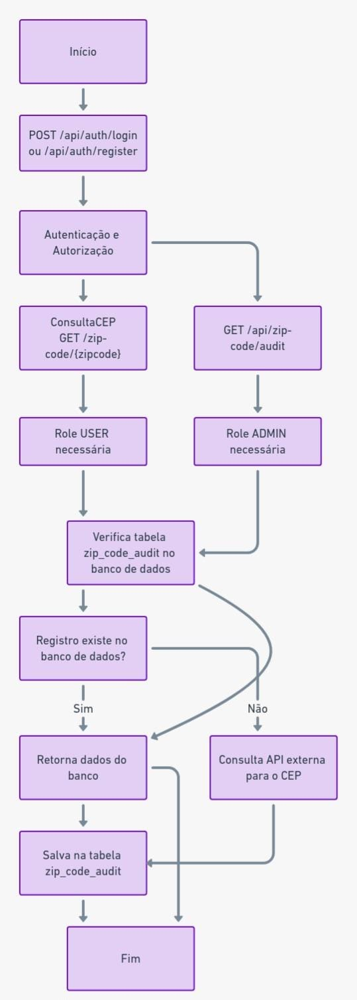

# README - Aplicação CEP Tracker

---

## **Descrição da Aplicação**
A aplicação **CEP Tracker** permite buscar informações de CEPs, armazená-las no banco de dados para futuras consultas e auditar as buscas realizadas. A aplicação também possui endpoints de login e cadastro para autenticação e gerenciamento de usuários.

---

## **Fluxo Principal**

  


## **Funcionalidades Principais**

### **1. Endpoints de Autenticação**
- **POST /login**
    - Autentica um usuário existente.
    - Requer as credenciais do usuário (usuário e senha).

- **POST /register**
    - Permite o cadastro de novos usuários.
    - Requer informações do usuário, como nome, e-mail e senha.

### **2. Busca de CEP**
- **GET /api/zip-code/{zipcode}**
    - Busca informações detalhadas sobre o CEP fornecido.
    - Caso o CEP já tenha sido consultado anteriormente, as informações são recuperadas do banco de dados.
    - Se o CEP não for encontrado no banco, a aplicação faz uma consulta a uma API externa (`http://localhost:8080/{zipcode}`) para obter os dados.
    - Salva o resultado da busca na tabela `zip_code_audit` para auditoria.
    - **Permissão necessária:** Usuários com a role `USER`.

### **3. Auditoria de Consultas de CEP**
- **GET /api/zip-code/audit**
    - Retorna o histórico de consultas realizadas na tabela `zip_code_audit`.
    - Exibe informações como o CEP consultado, os dados retornados e o usuário que realizou a consulta.
    - **Permissão necessária:** Usuários com a role `ADMIN`.

---

## **Estrutura da Aplicação**

### **1. Entidades Principais**

- **ZipCode**
    - Representa as informações detalhadas de um CEP.

- **User**
    - Registra os usuários da aplicação.

- **Role**
    - Registra as permissões dos usuários.

### **2. Camadas**
- **Controller:** Gerencia os endpoints e responde às requisições HTTP.
- **Service:** Contém a lógica de negócios para as operações da aplicação.
- **Repository:** Realiza as interações com o banco de dados.

---

## **Instalação e Execução**

### **Requisitos**
- **Java 17**
- **Maven**
- Banco de dados configurado (ex.: PostgreSQL, MySQL ou outro)
- API externa rodando localmente em `http://localhost:8080`
- Docer e docker-compose

### **Passos para Configuração**
1. Clone o repositório:
   ```bash
   git clone https://github.com/IgorBavand/ceptracker
